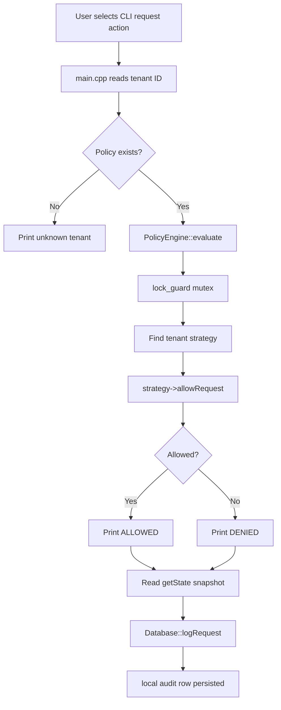
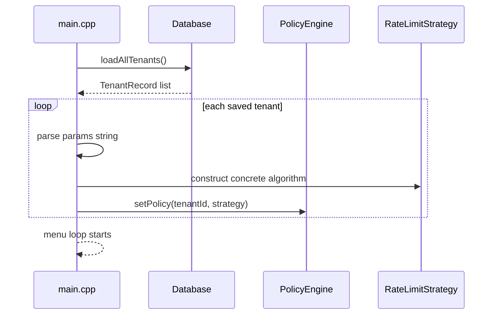

# Rlimit

Rlimit is a backend-focused C++ rate limiting engine that demonstrates how production API gateways, SaaS platforms, and multi-tenant backend systems control request traffic. It implements five classic rate limiting algorithms, a thread-safe policy engine, dependency-free local audit storage, Redis-backed distributed state, benchmark metrics, and a CLI for interactive simulation.

In a real backend system, rate limiting protects downstream services from overload, prevents abusive clients from consuming shared capacity, and gives each tenant predictable access to system resources. Rlimit models that problem directly: each tenant can be assigned a different algorithm and parameter set, requests are evaluated through a central policy engine, internal algorithm state can be inspected, and every evaluated request can be written to an audit log.

The project is intentionally written in C++ with a small number of files so the internals are visible. It is useful for learning rate limiter behavior, explaining concurrency bugs, comparing exact vs approximate sliding window algorithms, and showing how persistence and observability can be added around an in-memory engine.

---

## Project Status

Rlimit currently implements a complete CLI-based rate limiting engine with persistence, tests, and benchmarks.

Implemented features:

```text
C++17 rate limiting engine
Five rate limiting algorithms
Thread-safe PolicyEngine using std::mutex
Intentional unsafe evaluation path for race-condition demonstration
Per-tenant policy registration
PolicyResolver with tenant/endpoint matching from policy/policies.yaml
REST API for /evaluate and /policies
Redis-backed distributed state for TokenBucket, FixedWindowCounter, SlidingWindowCounter, and LeakyBucket
Tenant policy persistence using a local text store
Request audit logging using a local text store
CLI menu for simulations and inspection
Burst simulation with configurable interval
Thread-safety stress test
Standalone benchmark suite
Throughput benchmarking across all algorithms
Concurrency race variance measurement
SlidingWindowCounter accuracy comparison against SlidingWindowLog
Automated test suite with 71 passing tests
```

---

## High-Level Architecture

```text
                         +----------------------+
                         |      CLI Client      |
                         |      main.cpp        |
                         +----------+-----------+
                                    |
                                    v
                         +----------------------+
                         |    PolicyEngine      |
                         |  tenant -> strategy  |
                         |  mutex protected     |
                         +----------+-----------+
                                    |
       +----------------------------+----------------------------+
       |             |              |              |             |
       v             v              v              v             v
+-------------+ +-------------+ +-------------+ +-------------+ +-------------+
| TokenBucket | | FixedWindow | | SlidingLog  | | SlidingCtr  | | LeakyBucket |
|   O(1)      | |   O(1)      | | O(n) space  | |   O(1)      | |   O(1)      |
+-------------+ +-------------+ +-------------+ +-------------+ +-------------+
                                    |
                                    v
                         +----------------------+
                         |    Local file store  |
                         | rlimit_store.txt     |
                         | tenants/request log  |
                         +----------------------+

                         +----------------------+
                         |       Metrics        |
                         | standalone instances |
                         | no live state usage  |
                         +----------------------+
```

The CLI is the user-facing control layer. It does not implement rate limiting logic directly. Instead, it collects tenant IDs, algorithm choices, and simulation parameters, then delegates to `PolicyEngine`.

`PolicyEngine` owns one strategy object per tenant. Each concrete algorithm implements the shared `RateLimitStrategy` interface. This keeps the runtime behavior polymorphic while allowing the CLI and tests to treat all algorithms the same way.

The local file store sits beside the engine. It stores CLI tenant policy definitions and request audit logs. On startup, Rlimit loads tenant policies from `rlimit_store.txt` and reconstructs the corresponding in-memory algorithm objects. REST policy configuration lives in `policy/policies.yaml`, while live distributed limiter state lives in Redis.

The metrics system is intentionally separate from the live `PolicyEngine`. Benchmarks create fresh algorithm instances internally so measurement does not mutate real tenant state.

---

## Runtime Request Flow



Important detail:

```text
PolicyEngine::evaluate() is thread-safe.
PolicyEngine::evaluateUnsafe() intentionally has no mutex.
```

The unsafe path exists only to demonstrate why the mutex matters. It is used by the stress test and metrics race-variance benchmark.

---

## Core Interface

Every algorithm implements the same abstract interface:

```cpp
class RateLimitStrategy {
public:
    virtual bool allowRequest() = 0;
    virtual std::string getState() const = 0;
    virtual void reset() = 0;
    virtual std::string algorithmName() const = 0;
    virtual ~RateLimitStrategy() = default;
};
```

This interface gives the rest of the system four capabilities:

```text
allowRequest()
  Decide whether the next request should pass.

getState()
  Return a human-readable snapshot of internal algorithm state.

reset()
  Reset a tenant's algorithm state, mainly for repeatable tests.

algorithmName()
  Return the concrete algorithm name for display, logging, and persistence.
```

---

## Policy Engine

`PolicyEngine` is the central coordinator for tenant policies.

It owns:

```cpp
std::unordered_map<std::string, std::unique_ptr<RateLimitStrategy>> tenantPolicies_;
mutable std::mutex engineMutex_;
```

Responsibilities:

```text
Register or replace a tenant policy
Evaluate requests safely using a mutex
Expose an intentionally unsafe path for race demonstrations
Return current algorithm state
Return active algorithm name
Reset tenant state
Keep tenants isolated from each other
```

Safe evaluation:

```text
PolicyEngine::evaluate()
  Acquires std::lock_guard<std::mutex>
  Looks up tenant strategy
  Calls allowRequest()
  Releases mutex at scope exit
```

Unsafe evaluation:

```text
PolicyEngine::evaluateUnsafe()
  Does not acquire mutex
  Exists only for stress testing and education
```

This split makes the concurrency story visible. The same algorithm and same request count can produce correct results under `evaluate()` and over-allows under `evaluateUnsafe()`.

---

## Algorithms

Rlimit implements five algorithms:

```text
TokenBucket
FixedWindowCounter
SlidingWindowLog
SlidingWindowCounter
LeakyBucket
```

---

## 1. Token Bucket

Token Bucket is designed for burst-friendly traffic control.

Mental model:

```text
A bucket holds tokens.
Each request consumes one token.
Tokens refill over time.
If the bucket has at least one token, the request is allowed.
If the bucket is empty, the request is denied.
```

State:

```text
capacity
refillRatePerSec
tokens
lastRefill timestamp
```

Example params:

```text
capacity=1000|refill=500
```

Best for:

```text
APIs that allow short bursts
User-facing endpoints with natural traffic spikes
Systems where average rate matters more than perfectly smooth output
```

Complexity:

```text
Time:  O(1)
Space: O(1)
```

---

## 2. Fixed Window Counter

Fixed Window Counter counts requests inside a fixed time window.

Mental model:

```text
Keep a counter for the current window.
Allow requests while counter < limit.
When the window expires, reset the counter.
```

State:

```text
limit
windowSecs
counter
windowStart timestamp
```

Example params:

```text
limit=100|window=60
```

Strength:

```text
Very simple
Very fast
Low memory usage
```

Weakness:

```text
Boundary bursts are possible.
```

Boundary burst example:

```text
Limit = 100 requests/minute

Client sends 100 requests at 00:59
Client sends 100 more requests at 01:00

From the limiter's view:
  Previous fixed window had 100
  New fixed window has 100

In real time:
  200 requests may arrive almost back-to-back
```

Complexity:

```text
Time:  O(1)
Space: O(1)
```

---

## 3. Sliding Window Log

Sliding Window Log is the exact sliding window implementation.

Mental model:

```text
Store the timestamp of every allowed request.
Before each decision, remove timestamps older than the rolling window.
Allow if the number of remaining timestamps is below the limit.
```

State:

```text
limit
windowSecs
deque of request timestamps
```

Example params:

```text
limit=50|window=30
```

Strength:

```text
Exact rolling-window behavior
No fixed-window boundary burst
Easy to reason about
```

Weakness:

```text
Memory grows with traffic inside the window.
Eviction can require scanning old entries.
```

Complexity:

```text
Time:  O(1) amortized, O(n) worst-case eviction
Space: O(n), where n = accepted requests inside the window
```

---

## 4. Sliding Window Counter

Sliding Window Counter is an approximate sliding window algorithm.

Mental model:

```text
Keep the previous window count and current window count.
Estimate active traffic using a weighted value from the previous window.
The previous window contributes less as the current window progresses.
```

Formula:

```text
estimate = prevCount * (1 - fractionIntoCurrentWindow) + currCount
```

State:

```text
limit
windowSecs
prevCount
currCount
windowStart timestamp
```

Example params:

```text
limit=100|window=10
```

Strength:

```text
Near sliding-window behavior
Constant memory
Fast O(1) decisions
Good practical tradeoff for high-cardinality tenant systems
```

Weakness:

```text
It is approximate.
It assumes previous-window traffic was roughly uniform.
```

Complexity:

```text
Time:  O(1)
Space: O(1)
```

---

## 5. Leaky Bucket

Leaky Bucket smooths incoming bursts into a controlled output rate.

Mental model:

```text
Requests enter a queue.
The queue leaks at a steady rate.
If the queue has capacity, the request is accepted into the bucket.
If the queue is full, the request is denied.
```

State:

```text
capacity
leakRate
queue level
lastLeak timestamp
```

Example params:

```text
capacity=10|leakRate=2
```

Best for:

```text
Systems that cannot tolerate bursts
Downstream services requiring smooth traffic
Legacy databases or third-party APIs with hard per-second limits
```

Complexity:

```text
Time:  O(1)
Space: O(1)
```

---

## Algorithm Comparison

```text
+----------------------+----------------------+------------+------------+------------------------------+
| Algorithm            | Main Use Case        | Time       | Space      | Notes                        |
+----------------------+----------------------+------------+------------+------------------------------+
| TokenBucket          | Burst-friendly limit | O(1)       | O(1)       | Allows bursts up to capacity |
| FixedWindowCounter   | Simple rate cap      | O(1)       | O(1)       | Boundary burst possible      |
| SlidingWindowLog     | Exact rolling limit  | O(n) worst | O(n)       | Most accurate                |
| SlidingWindowCounter | Approx rolling limit | O(1)       | O(1)       | Practical approximation      |
| LeakyBucket          | Output smoothing     | O(1)       | O(1)       | Absorbs bursts into queue    |
+----------------------+----------------------+------------+------------+------------------------------+
```

---

## Persistence Architecture

Rlimit uses a small local text store for CLI policy persistence and request audit history. It has no external database dependency.

Default store file:

```text
rlimit_store.txt
```

Database wrapper:

```text
Database.h
Database.cpp
```

Responsibilities:

```text
Save tenant policies
Delete tenant policies
Load all tenant policies on program startup
Log every evaluated request
Return request audit logs
Return aggregate allowed/denied request counts
Gracefully degrade if the local store cannot be opened
```

If the local store cannot be opened, Rlimit prints a warning and continues running in memory:

```text
[DB ERROR] unable to open rlimit_store.txt
[DB WARNING] Persistence disabled; Rlimit will continue in memory.
```

---

The local store writes percent-escaped tab-separated rows. `TENANT` rows hold CLI policy definitions, and `REQUEST` rows hold audit history. The `params` field stores constructor arguments in a compact pipe-separated format.

Examples:

```text
TokenBucket           capacity=1000|refill=500
FixedWindowCounter    limit=100|window=60
SlidingWindowLog      limit=50|window=30
SlidingWindowCounter  limit=100|window=10
LeakyBucket           capacity=10|leakRate=2
```

---

## Startup Restore Flow



This means saved tenant policies survive process restarts.

Request counters and bucket levels are not serialized as live in-memory objects. The persisted policy is reconstructed fresh from algorithm type and parameters.

---

## Metrics System

The `Metrics` class runs standalone benchmarks.

It does not use or mutate the live `PolicyEngine`.

Metrics included:

```text
Throughput per algorithm
Concurrency stress variance
SlidingWindowCounter accuracy vs SlidingWindowLog
```

### Throughput Benchmark

For each algorithm:

```text
Create a fresh instance
Fire 100,000 requests
Measure wall-clock time
Calculate requests per second
```

This answers:

```text
Which algorithm is fastest under tight-loop evaluation?
How expensive is exact sliding-window logging compared with O(1) algorithms?
```

### Concurrency Race Variance

The benchmark runs:

```text
20 runs
2 threads per run
1000 requests per thread
TokenBucket capacity = 1000
No mutex through evaluateUnsafe()
```

It records:

```text
Minimum over-allows
Maximum over-allows
Average over-allows
How many runs triggered the race
```

This demonstrates that race conditions are non-deterministic. A single run might get lucky, but repeated stress runs make the bug visible.

### Sliding Window Accuracy

The benchmark compares:

```text
SlidingWindowCounter approximate algorithm
SlidingWindowLog exact algorithm
```

It runs randomized request timings and calculates:

```text
abs(counter_allows - log_allows) / log_allows * 100
```

This quantifies the approximation instead of describing it only theoretically.

---

## CLI Menu

Rlimit runs as an interactive CLI.

Menu:

```text
=== Rlimit CLI ===
1. Add tenant
2. Set rate limit policy (algorithm + params)
3. Simulate single request
4. Run burst simulation (N requests, configurable interval)
5. Show tenant state
6. Run thread-safety stress test (2 threads, 1000 req each)
7. Show request audit log (tenant)
8. Run benchmarks (throughput + concurrency variance + accuracy)
9. Exit
```

---

## Current Folder Structure

```text
RateLimiter/
  main.cpp
  RateLimitStrategy.h
  PolicyEngine.h
  PolicyEngine.cpp
  TokenBucket.h
  TokenBucket.cpp
  FixedWindowCounter.h
  FixedWindowCounter.cpp
  SlidingWindowLog.h
  SlidingWindowLog.cpp
  SlidingWindowCounter.h
  SlidingWindowCounter.cpp
  LeakyBucket.h
  LeakyBucket.cpp
  Database.h
  Database.cpp
  Metrics.h
  Metrics.cpp
  tester.cpp
  policy/
  api/
  storage/
  rlimit_store.txt
```

Generated files after building:

```text
Rlimit.exe
tester.exe
```

---

## Tech Stack

```text
C++17
STL containers
std::unique_ptr
std::mutex
std::lock_guard
std::thread
std::atomic
std::chrono
CLI application
Manual test harness
```

---

## Prerequisites

You need:

```text
C++ compiler with C++17 support
pthread support
```

On Windows with MinGW/MSYS2, make sure `g++` is available on PATH.

On Linux:

```bash
sudo apt update
sudo apt install g++
```

On macOS:

```bash
xcode-select --install
```

---

## Build the CLI

From the project root:

```bash
g++ -std=c++17 -O2 -pthread -o Rlimit main.cpp PolicyEngine.cpp TokenBucket.cpp LeakyBucket.cpp SlidingWindowCounter.cpp SlidingWindowLog.cpp FixedWindowCounter.cpp Database.cpp Metrics.cpp
```

On Windows, you can output an `.exe`:

```powershell
g++ -std=c++17 -O2 -pthread -o Rlimit.exe main.cpp PolicyEngine.cpp TokenBucket.cpp LeakyBucket.cpp SlidingWindowCounter.cpp SlidingWindowLog.cpp FixedWindowCounter.cpp Database.cpp Metrics.cpp
```

---

## Run the CLI

Linux/macOS:

```bash
./Rlimit
```

Windows PowerShell:

```powershell
.\Rlimit.exe
```

---

## Build and Run the REST API

The REST server is a separate entry point that keeps the CLI behavior intact.

Linux/macOS:

```bash
g++ -std=c++17 -O2 -pthread -I. -o rlimit_server \
  server_main.cpp PolicyEngine.cpp TokenBucket.cpp LeakyBucket.cpp \
  SlidingWindowCounter.cpp SlidingWindowLog.cpp FixedWindowCounter.cpp \
  Database.cpp StrategyFactory.cpp \
  api/JsonCodec.cpp api/RestController.cpp api/Server.cpp \
  policy/Policy.cpp policy/PolicyResolver.cpp policy/PolicyLoader.cpp \
  storage/StateStore.cpp storage/InMemoryStateStore.cpp storage/RedisStateStore.cpp \
  storage/RedisRateLimitStrategies.cpp
```

Windows builds also need `-lws2_32` for sockets.

Runtime configuration:

```text
HTTP_PORT=8080
REDIS_HOST=localhost
REDIS_PORT=6379
POLICY_FILE=policy/policies.yaml
AUDIT_STORE_PATH=rlimit_store.txt
```

Start Redis, then run:

```bash
./rlimit_server
```

Example request:

```bash
curl -X POST http://localhost:8080/evaluate \
  -H "Content-Type: application/json" \
  -d '{"tenant":"tenant-a","endpoint":"/login"}'
```

Policy requests intentionally use tenant and endpoint only. Role is not accepted because this project does not implement authentication.

Docker:

```bash
docker compose up --build
```

## Build and Run Tests

Build test runner:

```bash
g++ -std=c++17 -O2 -pthread -I. -o tester \
  tester.cpp PolicyEngine.cpp TokenBucket.cpp LeakyBucket.cpp \
  SlidingWindowCounter.cpp SlidingWindowLog.cpp FixedWindowCounter.cpp \
  Database.cpp Metrics.cpp StrategyFactory.cpp \
  api/JsonCodec.cpp api/RestController.cpp api/Server.cpp \
  policy/Policy.cpp policy/PolicyResolver.cpp policy/PolicyLoader.cpp \
  storage/StateStore.cpp storage/InMemoryStateStore.cpp storage/RedisStateStore.cpp \
  storage/RedisRateLimitStrategies.cpp
```

Windows PowerShell:

```powershell
g++ -std=c++17 -O2 -pthread -I. -o tester.exe tester.cpp PolicyEngine.cpp TokenBucket.cpp LeakyBucket.cpp SlidingWindowCounter.cpp SlidingWindowLog.cpp FixedWindowCounter.cpp Database.cpp Metrics.cpp StrategyFactory.cpp api/JsonCodec.cpp api/RestController.cpp api/Server.cpp policy/Policy.cpp policy/PolicyResolver.cpp policy/PolicyLoader.cpp storage/StateStore.cpp storage/InMemoryStateStore.cpp storage/RedisStateStore.cpp storage/RedisRateLimitStrategies.cpp -lws2_32
```

Run tests:

```bash
./tester
```

Windows:

```powershell
.\tester.exe
```

Expected summary:

```text
+------------------------------+
|        TEST SUMMARY          |
+------------------------------+
  Passed: 71
  Failed: 0
+------------------------------+
```

The graceful degradation test intentionally constructs a database with an invalid path. Seeing a DB warning during that test is expected.

---

## Example: Add a Tenant and Set Token Bucket

Start the CLI:

```powershell
.\Rlimit.exe
```

Choose:

```text
2. Set rate limit policy
```

Example input:

```text
Tenant ID: api-client-a
Algorithm: 1
Capacity: 5
Refill rate: 1
```

This creates:

```text
Tenant: api-client-a
Algorithm: TokenBucket
Params: capacity=5|refill=1
```

The policy is saved to the local store and restored on the next startup.

---

## Example: Simulate a Single Request

Choose:

```text
3. Simulate single request
```

Example output:

```text
[     12ms]  [ALLOWED]  tokens=4.00/5.00 refill=1.00/s
```

If the tenant exceeds the policy:

```text
[     18ms]  [DENIED]   tokens=0.00/5.00 refill=1.00/s
```

Each request is also written to the local audit log.

---

## Example: Run Burst Simulation

Choose:

```text
4. Run burst simulation
```

Example:

```text
Tenant ID: api-client-a
Number of requests: 10
Interval ms: 0
```

Expected behavior with `TokenBucket capacity=5 refill=0`:

```text
First 5 requests: allowed
Next 5 requests: denied
```

This makes burst behavior visible immediately.

---

## Example: Show Tenant State

Choose:

```text
5. Show tenant state
```

Example output:

```text
Algorithm : TokenBucket
State     : tokens=2.00/5.00 refill=1.00/s
```

Each algorithm exposes a different state snapshot:

```text
TokenBucket           tokens=2.00/5.00 refill=1.00/s
FixedWindowCounter    count=3/5 window=10.00s
SlidingWindowLog      log_size=3/5 window=10.00s
SlidingWindowCounter  prev=0 curr=3 f=0.20 estimate=3.00/5 window=10.00s
LeakyBucket           queue=2.00/5.00 leak=1.00/s
```

---

## Example: Thread-Safety Stress Test

Choose:

```text
6. Run thread-safety stress test
```

The stress test runs:

```text
2 threads
1000 requests per thread
TokenBucket capacity = 1000
```

The correct result is exactly:

```text
1000 allowed
```

Safe path:

```text
PolicyEngine::evaluate()
```

Unsafe path:

```text
PolicyEngine::evaluateUnsafe()
```

Expected story:

```text
With mutex:
  exactly 1000 allowed

Without mutex:
  sometimes more than 1000 allowed
  sometimes it gets lucky
```

This demonstrates a real read-modify-write race.

---

## Example: Request Audit Log

Choose:

```text
7. Show request audit log
```

Example output:

```text
+--------+----------------+--------+----------------------+----------------------------------+
| Req #  | Timestamp (ms) | Result | Algorithm            | State                            |
+--------+----------------+--------+----------------------+----------------------------------+
|      1 |            0ms | ALLOW  | TokenBucket          | tokens=2.00/3.00 refill=0.00/s   |
|      2 |            6ms | ALLOW  | TokenBucket          | tokens=1.00/3.00 refill=0.00/s   |
|      3 |           14ms | ALLOW  | TokenBucket          | tokens=0.00/3.00 refill=0.00/s   |
|      4 |           21ms | DENY   | TokenBucket          | tokens=0.00/3.00 refill=0.00/s   |
|      5 |           27ms | DENY   | TokenBucket          | tokens=0.00/3.00 refill=0.00/s   |
+--------+----------------+--------+----------------------+----------------------------------+
  Total: 3 allowed, 2 denied across 5 shown / 5 logged requests
```

This log is useful for debugging, demos, and explaining how limiter state changes over time.

---

## Example: Benchmark Report

Choose:

```text
8. Run benchmarks
```

Example output:

```text
+==========================================+
|         Rlimit Benchmark Report       |
+==========================================+

[1] Throughput (100,000 requests per algorithm)
+----------------------+------------+------------------+
| Algorithm            | Time (ms)  | Req/sec          |
+----------------------+------------+------------------+
| TokenBucket          |         8ms |         11752262 |
| FixedWindowCounter   |         6ms |         16619578 |
| SlidingWindowCounter |         8ms |         11648224 |
| LeakyBucket          |         2ms |         41580042 |
| SlidingWindowLog     |         9ms |         10149193 |
+----------------------+------------+------------------+

[2] Concurrency Race Variance (20 runs, 2 threads x 1000 req, NO mutex)
+------------------+------------------+------------------+------------------+
| Min Over-Allows  | Max Over-Allows  | Avg Over-Allows  | Races Fired      |
+------------------+------------------+------------------+------------------+
|                0 |              142 |             27.7 |         12/20     |
+------------------+------------------+------------------+------------------+

[3] SlidingWindowCounter Accuracy (5 runs x 100 requests vs SlidingWindowLog exact)
+--------------+----------------+-----------------+
| Log Allows   | Counter Allows | Avg Error %     |
+--------------+----------------+-----------------+
|           20 |             20 |           0.00% |
+--------------+----------------+-----------------+
```

Numbers vary by machine and current system load.

---

## Test Coverage

The current test suite covers:

```text
TokenBucket behavior
FixedWindowCounter behavior
SlidingWindowLog behavior
SlidingWindowCounter behavior
LeakyBucket behavior
Thread-safe evaluation
Unsafe race demonstration
Tenant isolation
Strategy reset behavior
Local file store initialization
Tenant save/load/upsert/delete
Request logging and aggregate counts
Audit log limit behavior
Metrics result shape
Metrics sanity bounds
Persistence round trips
Graceful database degradation
```

Current result:

```text
71/71 tests passing
```

---

## Why This Project Is Useful

Rlimit demonstrates backend engineering ideas that show up in real systems:

```text
Rate limiting algorithms
Polymorphic strategy pattern
Thread safety with mutexes
Race condition reproduction
Per-tenant isolation
Local file persistence
Audit logging
Benchmarking
Accuracy vs performance tradeoffs
CLI-driven simulation
```

---

## Design Choices

### Why multiple algorithms?

Different systems need different rate limiting behavior.

```text
TokenBucket:
  Good for bursty user traffic.

FixedWindowCounter:
  Simple and fast but can over-allow at boundaries.

SlidingWindowLog:
  Exact but memory-heavy.

SlidingWindowCounter:
  Approximate but O(1), good for scale.

LeakyBucket:
  Smooths output for fragile downstream systems.
```

### Why use a strategy interface?

The CLI and `PolicyEngine` do not need to know each algorithm's internal fields. They only need:

```text
allowRequest
getState
reset
algorithmName
```

This makes it easy to add a new algorithm without changing the entire engine.

### Why is `evaluate()` mutex-protected?

Rate limit decisions are read-modify-write operations.

For example, Token Bucket:

```text
Read tokens
Decide if tokens >= 1
Subtract one token
Return allowed
```

Without a mutex, two threads can both read the same token and both allow.

### Why keep `evaluateUnsafe()`?

It is a controlled demonstration path.

The project can show:

```text
The bug
The fix
The measured difference
```

That is more convincing than only saying "mutexes are important."

### Why a local file store?

The local file store gives the CLI and audit log persistence without a database dependency.

It is enough to demonstrate:

```text
Upsert behavior
Startup restore
Audit logging
Graceful degradation
```

---

## Future Improvements

Possible next steps:

```text
Expose Rlimit through an HTTP API
Add JSON policy import/export
Persist live algorithm state, not only policy definitions
Add per-tenant metrics dashboards
Add Prometheus-style metrics output
Add configurable benchmark request counts
Add GitHub Actions CI
Add Dockerfile for reproducible builds
```

---

## Repository

GitHub:

```text
https://github.com/lakshyasachan/Rlimit
```

