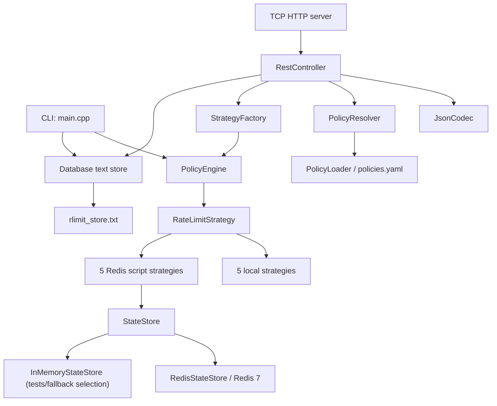
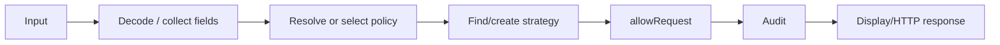
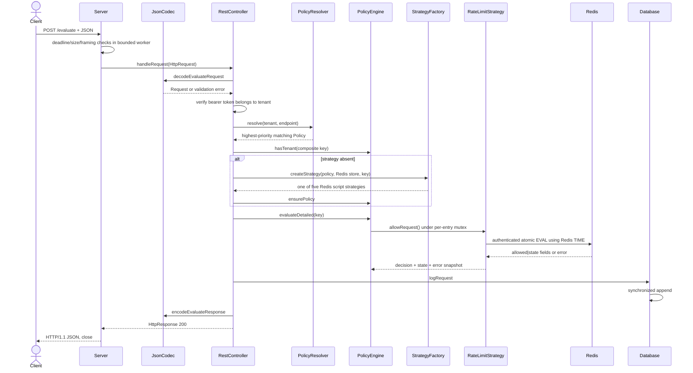
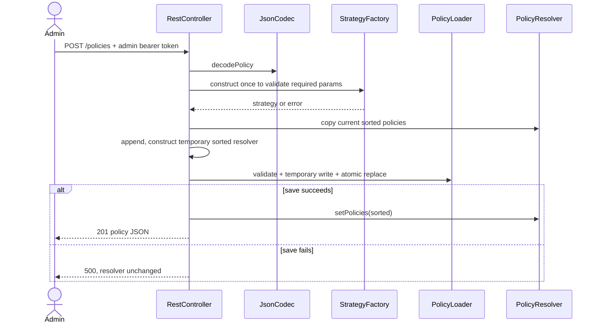

# Rlimit: Complete Technical Onboarding and Interview Guide

This guide is based on a complete pass over every tracked source, configuration, test, and deployment file in the repository at commit `1fb8d43`. It distinguishes the two executables—the CLI and REST server—because they share core types but have different policy and state paths. Line references use the current repository revision.

## 1. High-Level Overview

### Problem and features

Rlimit decides whether a request should be allowed before it reaches a protected backend. The business requirement is broader than “N requests per minute”: different tenants and endpoints may need different burst tolerance, accuracy, memory cost, and cross-instance consistency. The project makes those trade-offs explicit through five interchangeable algorithms:

- Token Bucket: sustained rate plus bounded bursts.
- Fixed Window Counter: cheapest simple quota, with boundary-burst weakness.
- Sliding Window Log: exact rolling-window enforcement at O(n) space.
- Sliding Window Counter: approximate rolling-window enforcement at O(1) space.
- Leaky Bucket: models admission into a queue that drains continuously.

Major features are a common strategy interface, per-key strategy ownership, priority-based policy resolution, a CLI simulator, an authenticated REST API with health/metrics routes, Redis/Lua distributed state for all five algorithms, append-oriented local audit/policy persistence, concurrency demonstrations, benchmarks, and 85 automated checks.

### Architecture



There are two main execution paths:

1. `main.cpp` starts an interactive CLI, restores tenant algorithm definitions from `rlimit_store.txt`, and keeps live limiter state in process memory.
2. `server_main.cpp` validates credentials and Redis/audit readiness, loads `policy/policies.yaml`, and constructs the REST stack. All five algorithms execute atomic Redis Lua scripts; exact Sliding Window Log uses a sorted set.

### Main execution flow



The critical invariant is that deciding and updating limiter state must be one atomic read-modify-write operation. Locally, `PolicyEngine::evaluate` holds a mutex across `allowRequest`. Across processes, Redis strategies perform the entire decision in one Lua `EVAL`.

### Design philosophy

- Keep algorithms visible and dependency-light for learning and interviews.
- Program to `RateLimitStrategy`, so orchestration does not depend on concrete state.
- Separate policy selection from rate-limit execution.
- Demonstrate both correct and intentionally unsafe concurrency behavior.
- Fail closed on Redis script failure while returning HTTP 503, so dependency outages are not confused with policy denials.
- Prefer a runnable demonstration over production completeness.

### Strengths and limitations

Strengths: algorithms are small and inspectable; policy ordering is deterministic; ownership is explicit; all Redis updates are atomic and server-timed; endpoints have isolated quota keys; bearer credentials bind callers to tenants; per-strategy locks permit unrelated keys to execute concurrently; and tests exercise both original behavior and hardening regressions.

Remaining boundaries: the HTTP and Redis clients are still educational native implementations rather than maintained framework clients; YAML supports the repository schema rather than the entire YAML standard; bearer tokens are static credentials rather than JWT/mTLS identity-provider integration; Redis TLS/HA discovery is external; the audit store is single-process rather than a guaranteed multi-process event pipeline; and graceful orchestrator drain, real-Redis CI, chaos/load testing, and full telemetry export remain deployment work. The earlier correctness, authentication, validation, O(R²) audit, clock, TTL, endpoint-key, concurrency, health, CMake, and CI defects are fixed.

## 2. Technology Stack

| Technology | Version | Why / problem solved | Integration and important APIs | Alternatives | Repository locations |
|---|---:|---|---|---|---|
| C++ | C++17 | Deterministic resource management, standard concurrency, fast low-level algorithms, and no runtime framework dependency. | Virtual interfaces, RAII, `unique_ptr`, STL containers, chrono, threads. | Rust for memory safety; Go for simpler services; Java for mature gateway libraries. | All `.h/.cpp`; compile flags in `README.md` and `Dockerfile`. |
| STL | Compiler-provided | Supplies collections, ownership, clocks, locking, strings, streams, sorting, and random generation. | `unordered_map`, `map`, `deque`, `vector`, `mutex`, `lock_guard`, `thread`, `atomic`, `steady_clock`, `stable_sort`. | Boost or specialized concurrent containers. | Core, policy, storage, tests. |
| POSIX/Winsock TCP sockets | OS API | Avoids an HTTP or Redis client dependency and exposes protocol mechanics. | `socket`, `bind`, `listen`, `accept`, `recv`, `send`, `getaddrinfo`; Winsock startup on Windows. | Boost.Asio/Beast, Drogon, Crow, libcurl, hiredis. | `api/Server.cpp`, `storage/RedisStateStore.cpp`. |
| HTTP/1.1 subset | Hand-written | Makes REST calls possible with a bounded dependency-free transport. | Worker pool/queue, deadlines, strict framing, 16 KiB headers, 1 MiB bodies, partial-I/O loops, `Connection: close`. | A production HTTP framework with TLS, keep-alive, routing, and mature protocol coverage. | `api/HttpTypes.h`, `api/Server.cpp`, `api/RestController.cpp`. |
| Structural JSON parser | Hand-written | Strictly decodes the fixed API schemas without a dependency. | Recursive object/array/string/number parsing; duplicate, type, unknown-field, depth, and trailing-content checks. | `nlohmann/json`, RapidJSON, simdjson. | `api/JsonCodec.*`. |
| YAML subset | Hand-written | Makes policies editable outside C++ while remaining dependency-free. | Line/indent parser, comments, aliases, serialization. | yaml-cpp; JSON/TOML; database-backed policy service. | `policy/PolicyLoader.*`, `policy/policies.yaml`. |
| Redis | `redis:7-alpine` | Shares atomic live limiter state among server instances. | Authenticated persistent-per-worker RESP sessions, `EVAL`, Redis `TIME`, correct TTL/PERSIST, hash-tagged keys, readiness `PING`. | A maintained TLS/Cluster-aware Redis client or gateway-native limiter. | `docker-compose.yml`, `storage/Redis*`, `StrategyFactory.cpp`. |
| Lua in Redis | Redis embedded runtime | Converts multi-key read/compute/write decisions into a single atomic server-side operation. | `GET`, `SET`, `ZADD`, `ZCARD`, `TIME`, `EXPIRE`/`PERSIST`. | Redis Functions or a maintained limiter service. | `storage/RedisRateLimitStrategies.cpp`. |
| Flat text persistence | Repository implementation | Gives CLI policy restore and bounded audit history without a database library. | Percent escaping, mutex-protected O(1) audit append, 100k retention, atomic replacement for tenant/compaction writes. | PostgreSQL, append-only log, Kafka/object storage. | `Database.*`. |
| CMake and GitHub Actions | CMake 3.16+ | Provides reproducible targets and dependency-free CI. | `Rlimit`, `rlimit_server`, `tester`, CTest; warning-enabled Linux CI. | Bazel, Meson, Make. | `CMakeLists.txt`, `.github/workflows/ci.yml`. |
| Docker | Debian 12 slim | Provides a reproducible Linux build/runtime image. | Multi-stage warning-enabled build, minimal curl runtime, non-root user, health check. | Native packages or orchestrator buildpacks. | `Dockerfile`. |
| Docker Compose | Compose specification; Redis 7 | Starts authenticated service dependencies with durability/readiness. | Private Redis, AOF and named volumes, required secrets, health-gated dependency, policy bind mount. | Kubernetes, Nomad, systemd. | `docker-compose.yml`, `.env.example`. |
| Manual test harness | No framework | Keeps assertions and timing tests dependency-free. | `check`, global pass/fail counts, real sleeps, direct controller calls. | GoogleTest, Catch2, doctest, benchmark libraries. | `tester.cpp`. |

The verified Windows toolchain was MSYS2 UCRT64 GCC 15.2.0. The first `g++` on this machine was MinGW GCC 6.3 and failed to provide working `std::thread`/`std::mutex`; Windows developers must use a modern thread-capable toolchain. The Docker image installs Debian 12's current packaged compiler at build time, so the precise GCC patch version is not pinned.

## 3. Repository Structure

```text
repository root/
├── api/                 HTTP types, codec, controller, socket server
├── policy/              Request/policy model, loader, resolver, sample policies
├── storage/             StateStore abstraction, memory store, Redis client/strategies
├── *Bucket/Window*      Five local algorithm implementations
├── PolicyEngine.*       In-process strategy registry and lock boundary
├── StrategyFactory.*    Algorithm construction and Redis/local selection
├── Database.*           Local tenant/audit text store
├── Metrics.*            Educational microbenchmarks
├── main.cpp             CLI entry point
├── server_main.cpp      REST entry point/composition root
├── tester.cpp           Entire automated test harness
├── Dockerfile           REST server image build
├── docker-compose.yml   REST + Redis topology
└── README.md            User-facing build and usage guide
```

`api/` depends on the policy layer, `PolicyEngine`, `Database`, `StrategyFactory`, and optional `StateStore`. It should be viewed as transport/orchestration, not algorithm code.

`policy/` owns request matching and configuration. It depends only on standard C++ and is independent of HTTP and storage. This is why the resolver can be tested without sockets.

`storage/` owns live state abstractions. `RedisStateStore` is a low-level RESP client; `RedisRateLimitStrategies.cpp` adapts Redis scripts back to `RateLimitStrategy`. `InMemoryStateStore` implements primitive key operations but does not support scripts, so the factory selects normal local strategy objects when given it.

The root algorithm files are cohesive strategy implementations. `PolicyEngine` owns them, while `StrategyFactory` centralizes construction for REST. The CLI predates the factory and duplicates construction in `main.cpp::makeStrategy` and `setPolicyMenu`.

## 4. Execution Flow

### REST startup

Call chain:

```text
server_main.cpp::main
  -> envOrDefault/envIntOrDefault
  -> PolicyLoader::loadFromFile
       -> line parser helpers
       -> validatePolicyConfiguration
       -> PolicyResolver constructor (sorts a copy)
  -> PolicyResolver(loaded.policies)
  -> PolicyEngine()
  -> Database(dbPath) -> create/open -> loadFromFile
  -> validate Redis/admin/tenant credentials and worker/port ranges
  -> RedisStateStore(redisHost, redisPort, password)
  -> Database and Redis readiness checks [fail startup if unavailable]
  -> RestController(..., tenantTokens, adminToken)
  -> Server(..., workers, maxQueue).run()
       -> WSAStartup on Windows
       -> socket -> SO_REUSEADDR -> bind -> listen
       -> bounded worker pool + accept/queue loop
```

REST startup is fail-fast for policy configuration, credential strength/shape, writable audit storage, and authenticated Redis readiness. This prevents a process from advertising readiness when it cannot make or record decisions.

### REST request call chain

```text
Server::run
  -> accept -> set deadlines -> bounded queue -> worker
  -> readRequest(client) [header/body/framing limits]
  -> parseHttpRequest(raw)
  -> RestController::handleRequest
       -> evaluate | policy admin | health | metrics
  -> serializeHttpResponse
  -> sendAll
  -> closeSocket
```

For `POST /evaluate`:

```text
JsonCodec::decodeEvaluateRequest
  -> tenant bearer-token authorization
  -> PolicyResolver::resolve
  -> buildPolicyKey(tenant, endpoint, policy)
  -> PolicyEngine::hasTenant
  -> createStrategy(..., StateStore*, policyKey)
       -> createRedisBackedStrategy for every algorithm
       -> PolicyEngine::ensurePolicy
  -> PolicyEngine::evaluateDetailed
       -> registry shared lock, then per-entry lock
       -> RateLimitStrategy::allowRequest
            -> RedisStateStore::eval -> authenticated persistent TCP/RESP
       -> capture allow + algorithm + state + dependency error atomically
  -> Database::logRequest -> synchronized append
  -> JsonCodec::encodeEvaluateResponse
```

`hasTenant` and `ensurePolicy` remain a safe lazy check/insert pair: concurrent workers may construct a redundant temporary object, but only one is installed. Resolver reads, policy mutation, engine registry/entries, diagnostic snapshots, and audit access now have explicit synchronization.

### CLI startup and loop

```text
main.cpp::main (348)
  -> PolicyEngine()
  -> Database() -> loads text rows
  -> loadAllTenants
  -> makeStrategy(algorithm, params)
  -> PolicyEngine::setPolicy
  -> menu loop
       -> configure / evaluate / burst / inspect / stress / audit / benchmark
```

The “Add tenant” menu option creates no object and persists nothing; it is informational. A tenant effectively exists only after `setPolicyMenu` installs a strategy and calls `Database::saveTenant`.

## 5. Core Components

### Strategy interface and local algorithms

`RateLimitStrategy.h` defines decide, inspect, reset, identity, and optional `lastError` operations. The error channel lets Redis dependency failures remain distinct from normal denials. A virtual destructor makes polymorphic ownership correct.

Each strategy owns mutable state and assumes its caller provides synchronization. None contains a mutex. That prevents double locking and lets `PolicyEngine` make the entire operation atomic, but direct concurrent calls to a local strategy are unsafe.

### PolicyEngine

`PolicyEngine` owns a registry of shared entry objects. A `shared_mutex` protects only registry lookup/replacement, while each entry owns the mutex guarding one strategy. `evaluateDetailed` releases the registry lock before taking the entry lock and returns the decision plus diagnostic snapshot in one critical section. Unrelated tenants/endpoints therefore execute concurrently, including during Redis I/O. `evaluateUnsafe` remains an explicit test-only data-race demonstration.

### Policy model, loader, resolver

`Request` carries tenant, endpoint, and receive time. `Policy` has optional exact tenant/endpoint matchers, priority, algorithm, numeric parameters, and original order. Empty match criteria act as wildcards.

`PolicyLoader` recognizes the repository's constrained top-level YAML schema, normalizes aliases, safely escapes/decodes configured strings, rejects `role`, and invokes centralized semantic validation for required parameters, finite/range/integer rules, match lengths, and absolute endpoint paths.

`PolicyResolver` stable-sorts descending priority, then linearly returns the first match. Stable sorting makes file order the deterministic tie-breaker. Lifecycle: loaded once at startup, replaced synchronously after a successful POST and file save.

### Factory

`createStrategy` first invokes centralized validation, then returns a concrete strategy. Any script-capable store selects a Redis-backed implementation for all five algorithms. `buildPolicyKey` length-prefixes tenant and endpoint before algorithm/parameters, preventing delimiter collisions and accidental cross-endpoint quota sharing.

### REST stack

`Server` is a bounded concurrent transport adapter. `RestController` performs routing, tenant/admin authorization, counters, policy mutation, health, and application orchestration. `JsonCodec` is a structural parser/serializer. Controller tests still bypass sockets; live-socket integration remains a separate deployment test.

### Storage

`Database` is a legacy name for a mutex-protected single-process text store. Audit writes append in O(1), while rare tenant/retention compaction uses temporary-file replacement. `RedisStateStore` speaks bounded RESP2, authenticates, applies deadlines, reuses one connection per worker, discards ambiguous failed sessions without unsafe retry, and exposes health. Redis strategy classes remain private factory-created adapters.

### Metrics

`Metrics` constructs fresh strategies, so benchmarks do not mutate production/CLI tenant state. It measures tight-loop throughput, repeated intentional races, and exact-vs-approximate accepted counts. These are demonstrations, not statistically rigorous benchmarks: they include clock calls, use real sleeps, do not warm up, and do not report distributions.

## 6. Request/Data Flow

### Complete REST evaluation



Files involved: `api/Server.cpp`, `api/HttpTypes.h`, `api/RestController.cpp`, `api/JsonCodec.cpp`, `policy/Request.h`, `policy/Policy.cpp`, `policy/PolicyResolver.cpp`, `StrategyFactory.cpp`, `PolicyEngine.cpp`, one local algorithm or `storage/RedisRateLimitStrategies.cpp`, `storage/RedisStateStore.cpp`, and `Database.cpp`.

An allow and a normal deny both return HTTP 200; the business decision is in `allowed`/`result`. Authentication returns 401/403, decode errors 400/415, no policy 404, oversized input 413/431, and Redis/state failure 503.

### Policy creation



There is no update/delete endpoint. POST appends under a policy-mutation mutex. A different algorithm/parameter/endpoint produces a different key; semantically identical policy configuration intentionally keeps the same quota state rather than granting a reset.

## 7. Database Layer

There is no relational database, ORM, schema migration, SQL query, relationship, or index. Commit `1fb8d43` removed SQLite; this hardening change added CMake and corrected the remaining CLI wording.

The text schema is:

```text
TENANT  <encoded id> <encoded name> <encoded algorithm> <encoded params>
REQUEST <encoded tenant> <timestampMs> <encoded result> <encoded algorithm> <encoded state>
```

Fields are tab-separated and percent-escaped. Construction loads the current tenant and bounded request history. Audit append is O(1) file I/O under a mutex. Tenant changes and retention compaction perform an O(T+R) temporary rewrite and atomic replacement. History is capped at 100,000 current records; aggregates remain O(R), and recent retrieval scans backward with early stop.

Thread-level locking, retention, and replacement writes are implemented. Malformed timestamp rows are logged and skipped rather than crashing startup, and a runtime write failure marks the store unavailable so readiness and evaluation return 503. The store remains a single-process local facility: it has no cross-process coordination, fsync/ack protocol, pagination/index, schema version, or durable corrupt-row quarantine/report. Multi-process guaranteed delivery still belongs in a database or append/event pipeline.

Redis is not the “database layer” for policy/audit data; it is ephemeral live limiter state. TTLs bound idle key growth. Each local logical strategy uses two or three Redis keys, and its Lua script makes updates atomic.

## 8. APIs

All routes are in `RestController::handleRequest`. Evaluation uses per-tenant bearer authentication; policy and metrics routes use a separate admin token; JSON content types are enforced when supplied; health is intentionally public. Bearer headers avoid cookie/CSRF semantics, and CORS is not enabled.

### `POST /evaluate`

Purpose: resolve and execute one rate-limit decision.

Request:

```json
{"tenant":"tenant-a","endpoint":"/login"}
```

`tenantId` is accepted as an alias, but both aliases cannot be present. Tenant is bounded, endpoint must be a bounded absolute path, unknown/duplicate/wrongly typed fields are rejected, and the bearer token must map to the supplied tenant. `role` remains rejected because static tenant credentials do not establish roles.

Success (always 200 for the business decision):

```json
{"allowed":true,"result":"ALLOW","tenant":"tenant-a","endpoint":"/login","policyKey":"...","algorithm":"TokenBucket","state":"tokens=9/10 refill=1/s"}
```

Errors: 401 missing authentication, 403 wrong/cross-tenant credential, 400 malformed/unsupported input, 415 wrong content type, 404 no policy, and 503 state-store failure. REST refuses startup if its audit store is unavailable.

### `GET /policies`

Purpose: return the in-memory, priority-sorted policy set. Parameters: none. Response 200:

```json
{"policies":[{"priority":100,"match":{"endpoint":"/login"},"algorithm":"TokenBucket","params":{"capacity":10,"refill":1}}]}
```

This requires the admin bearer token.

### `POST /policies`

Purpose: append a policy, save the whole YAML file, then replace the resolver set.

The structural decoder supports root or nested `match`/`params` forms, rejects ambiguity/unknowns/duplicates/trailing input, and then invokes the same typed semantic validator used by YAML and the factory. Capacity/window/limit must be positive, limits integral, rates non-negative, values finite, and parameters exact for the algorithm.

Responses: 201 created, 401/403 authentication/authorization, 400 validation, 415 media type, and 500 persistence failure. Policy mutations are serialized and files are atomically replaced. Stable policy IDs, update/delete, and request idempotency are still extension points.

Known paths with wrong methods return 405 and `Allow`; unknown paths return 404; query strings are removed before routing. Public `/health/live` and `/health/ready` plus admin `/metrics` complete the operational API.

## 9. Authentication & Authorization

The server requires `TENANT_API_KEYS`, a semicolon-delimited tenant-to-token map, and `ADMIN_API_KEY`. Tokens must be at least 16 characters. Constant-time comparison binds evaluation credentials to the body tenant, preventing cross-tenant quota consumption; a separate admin credential protects policy listing/mutation and metrics. The server refuses insecure missing configuration.

This is service-level bearer authentication, not a login/session system. Production can replace the environment map with gateway-verified JWT or mTLS identity while preserving the controller boundary. TLS should terminate at a hardened proxy or a future maintained HTTP stack. `role` remains rejected until trusted claims provide it.

## 10. Business Logic

The actual business decision is a combination of policy precedence, state namespace, and algorithm:

1. Policies are sorted descending by `priority`; equal priority retains file/vector order.
2. A policy matches when every configured exact matcher matches; omitted matchers are wildcards.
3. The first match wins. The sample makes `/login` priority 100 for every tenant, `premium-tenant` priority 50 elsewhere, and a priority-1 global fallback.
4. REST builds a length-prefixed tenant and endpoint key followed by normalized algorithm/parameters. Endpoints remain isolated and delimiter-containing input cannot collide.
5. A strategy performs one allow/deny transition. Denied Token/Fixed/Sliding requests do not consume state; a Leaky Bucket denial does not increase the queue.
6. The decision and resulting state are captured under one entry lock and audited using Unix epoch milliseconds in both CLI and REST.

Important edge cases:

- Unknown CLI tenant is checked before evaluation. `PolicyEngine::evaluate` itself returns `false` for missing keys, conflating “not configured” with “denied.”
- Direct constructors still permit zero values for algorithm unit tests, but every CLI/YAML/REST/factory configuration path rejects non-positive capacity/window/limit, non-integral limits, negative rates, non-finite values, and unexpected parameters.
- Local algorithms use `steady_clock`. Redis scripts call Redis `TIME`, eliminating cross-host application clock skew.
- All five REST algorithms are distributed; Sliding Window Log uses atomic sorted-set eviction/count/add with a unique sequence member.
- Positive-rate Token/Leaky TTL is derived from the actual capacity/rate recovery interval. Zero-rate keys use `PERSIST` so expiration cannot mint capacity.
- `getState` for Token Bucket shows last-mutated tokens without a display-time refill, while Leaky Bucket computes display-only drainage. State strings are diagnostics, not stable machine-readable contracts.

## 11. Important Algorithms

### Token Bucket (`TokenBucket.cpp:8-46`)

Problem: permit bursts up to `capacity` while enforcing an average refill rate. It starts full. On each request, `refill` computes elapsed monotonic seconds, adds `elapsed * refillRate`, caps at capacity, advances `lastRefill`, then consumes one token if available.

Example: capacity 5/refill 2. After five immediate allows, tokens are 0. After 1.25 seconds, 2.5 tokens accrue; two requests pass and about 0.5 remains. Fractional tokens make continuous-time refill smooth.

Time O(1), space O(1). Inputs are centrally validated and engine synchronization is per quota key. Useful future extensions are injected clocks for faster deterministic local tests and configurable request weights. The Redis version performs the transition atomically using Redis `TIME`; positive refill uses a true `ceil(2 * capacity / refill)` recovery TTL, while zero refill uses `PERSIST` because expiration would incorrectly recreate tokens.

### Fixed Window Counter (`FixedWindowCounter.cpp:8-52`)

Problem: cheaply cap requests in a coarse interval. If elapsed time is at least `windowSecs`, it resets count and anchors a new window at the current request; otherwise it allows only while `counter < limit`.

Time O(1), space O(1). The key weakness is boundary amplification: `limit` requests just before expiry plus `limit` just after can pass in a very short real interval. Windows are request-anchored rather than aligned to calendar boundaries. Improve with fixed epoch buckets in Redis, sliding windows, or multiple subwindows.

### Sliding Window Log (`SlidingWindowLog.cpp:7-52`)

Problem: enforce an exact rolling limit. The deque is chronological. `evictOldEntries` removes `front <= now-window`; if remaining size is below the limit, it appends `now`.

Each accepted timestamp is inserted and removed once: amortized O(1) per request, O(n) worst-case eviction, O(limit) retained space because denied requests are not recorded. `getState` scans O(n) because it is const and does not evict. Improvements: store integer timestamps compactly, inject time, use a Redis sorted set with an atomic Lua script for distributed exactness, or use bucketed approximations for high cardinality.

### Sliding Window Counter (`SlidingWindowCounter.cpp:7-76`)

Problem: approximate rolling enforcement with constant memory. State is previous count, current count, and current-window start. At fraction `f` into the current window:

```text
estimate = previous * (1 - f) + current
allow when estimate < limit; then current++
```

On one elapsed window, current becomes previous. On two or more, previous becomes zero. `windowStart` advances by whole windows rather than resetting to `now`, preserving phase and a correct fractional remainder.

Time O(1), space O(1). It assumes previous-window requests were uniformly distributed. Burst placement can make the estimate differ from the true rolling count. Because it checks the pre-increment estimate, an accepted request can take the post-decision estimate slightly above `limit` when the estimate was fractional. Improve with multiple sub-buckets, configurable accuracy, or exact logs.

### Leaky Bucket (`LeakyBucket.cpp:8-51`)

Problem: bound a conceptual queue while it drains continuously. Before admission, `queue = max(0, queue - elapsed*leakRate)`. A request passes when `queue + 1 <= capacity`, then increments the level.

Time O(1), space O(1). This implementation does not actually delay and release work at a constant rate; it only admits into a virtual queue. Therefore describing it as “output is emitted at leakRate” overstates the implementation. A real traffic shaper needs a queue and worker/scheduler; this class is an admission limiter modeling queue occupancy.

### Policy resolution (`PolicyResolver.cpp:6-30`)

Stable sort is O(P log P) when policies change; each resolution is O(P). Exact string matching is O(length). For a small static policy list this is easy to audit. At scale, index by tenant/endpoint or compile rules into a decision tree, while preserving explicit precedence and tie-breaking.

### Percent encoding and parsing

`Database.cpp:12-47` converts unsafe bytes to `%HH`, allowing tabs/newlines in fields without corrupting row boundaries. Encoding/decoding is O(field length). It is not URL encoding semantically and has no checksum/version.

`PolicyLoader.cpp` is a state machine over lines: remove comments outside quotes, count indentation, detect `-`, switch into/out of `match`, parse key/value, validate, flush. It is O(file size), but not a YAML-compliant parser.

`RedisStateStore.cpp` parses RESP2 with 16-level nesting, 1,024-array-item, 16 MiB bulk, and line limits. Partial I/O and two-second socket deadlines are handled. RESP3 and TLS are not implemented.

## 12. State Management

| State | Owner | Mutation | Lifetime / synchronization |
|---|---|---|---|
| Local limiter fields | Concrete strategy object | `allowRequest`, `reset` | Process lifetime; guarded externally by `PolicyEngine` in normal paths. |
| Strategy registry | `PolicyEngine` | `setPolicy`, `ensurePolicy` | Shared registry lock plus one mutex per strategy entry. |
| REST policies | `PolicyResolver` | startup load, successful POST | Shared-mutex reads/replacement plus serialized atomic policy-file mutation. |
| CLI policies/audits | `Database` vectors + file | save/delete/log | Mutex-protected in process; append audit and atomic replacement for rewrites. |
| Distributed limiter fields | Redis keys | atomic Lua scripts | Until TTL or reset; shared across instances using identical keys. |
| Redis diagnostic state | `RedisScriptStrategy::lastState_` | after each call | Local object only; not authoritative distributed state. |
| In-memory store values/TTL | `InMemoryStateStore` | primitive operations | Store lifetime; mutex protected; lazy expiry on get/incr only. |
| Benchmark/test counts | Stack objects and atomics | test workers | One run. |

Data ownership is mostly RAII-based. `PolicyEngine` exclusively owns strategies through `unique_ptr`; controllers hold references to longer-lived composition-root objects; Redis strategies hold a reference to `StateStore`, safe because `server_main` constructs Redis before controller/server and destroys in reverse order.

CLI restores only algorithm configuration, never live counter levels. REST live state for all five algorithms survives server restarts until its correct TTL (or indefinitely for zero-rate Token/Leaky state). Docker Compose also persists Redis AOF data.

## 13. Concurrency / Async Flow

The HTTP server uses a fixed worker pool and bounded connection queue. I/O remains blocking per worker, but five-second deadlines and queue rejection prevent one slow client or unbounded accepted work from consuming the service indefinitely.

Concurrency exists in tests/benchmarks and in the design boundary:

- `PolicyEngine` uses a short shared registry lookup and a per-entry decision mutex, allowing unrelated quota keys to proceed concurrently.
- `evaluateDetailed` captures allow/algorithm/state/error under that one entry lock.
- `evaluateUnsafe` intentionally creates a C++ data race. This is technically undefined behavior, not merely a predictable lost-update anomaly.
- Test result counting uses `atomic<int>` so the measurement counter itself does not race.
- Redis `EVAL` is atomic relative to other Redis commands and handles cross-process updates.
- `InMemoryStateStore` locks individual primitive methods, but a composite `get` then `set` sequence would not be atomic. This is why it reports no script support and the factory uses a locally guarded strategy instead.

The worker-pool transition fixed resolver, database, policy-write, per-strategy diagnostic, partial-send, and decision-snapshot races. `evaluateUnsafe` and its benchmark remain deliberately undefined test-only behavior. One low-level Windows concern remains: function-static Winsock readiness in the Redis client is not a general lifecycle manager, though normal server startup initializes Winsock before workers.

## 14. Design Patterns

- Strategy: `RateLimitStrategy` plus five local/five Redis implementations. It isolates algorithms behind a stable decision/error interface.
- Factory: `StrategyFactory` maps configuration to concrete strategies and chooses distributed/local backing.
- Dependency Injection: `RestController` receives resolver, engine, database, and optional store references. Tests inject local objects and an empty policy path.
- Adapter: Redis script classes adapt `StateStore::eval` results to `RateLimitStrategy`; `Server` adapts sockets to `HttpRequest/HttpResponse`.
- Repository-like gateway: `Database` centralizes tenant/audit persistence, though it is not a true domain repository and exposes concrete records.
- Layered architecture: transport -> controller -> policy/application orchestration -> strategy/storage.
- Template Method-like base: `RedisScriptStrategy` supplies `runScript` and diagnostic handling; subclasses supply scripts and decoding.
- Composition root: `server_main.cpp` creates and wires long-lived dependencies.
- RAII: `unique_ptr`, `lock_guard`, stream objects. Raw sockets are not RAII-wrapped, so early-return resource safety is manual.

Not present: MVC UI architecture, Observer/event bus, Decorator, Command objects, a Singleton service, or a general rules engine. Function-local static `programStart` is singleton-like state, but not an application Singleton pattern.

## 15. Error Handling

There are no custom exceptions. Most application boundaries return result structs, booleans/null pointers, error strings, or HTTP responses.

- Policy startup errors: detailed path/line message, process exits 1.
- Strategy construction: `nullptr` plus optional string; REST maps it to 400.
- JSON decode: `{ok,error}`; mapped to 400.
- Database open failure: CLI can degrade locally; REST fails startup because auditing is required.
- Redis command/script failure: returns an explicit strategy error; controller increments dependency metrics and returns 503. The ambiguous connection is discarded and not blindly retried.
- Socket setup errors: `Server::run` returns false and `main` exits nonzero.
- Malformed/framing/size/media errors map to 400/408/413/415/431; known wrong methods return 405; unknown routes 404.
- Persistence parse: malformed audit timestamps are logged and skipped; invalid restored CLI strategy parameters are rejected instead of terminating the process.

Redis connections are reused per worker. A failed in-flight script is deliberately not retried because a lost response may follow a committed decision; the API conservatively returns 503. File replacement uses bounded Windows sharing retries because it is safe to repeat before replacement succeeds.

`validatePolicyConfiguration` is the centralized validator shared by YAML and both factory overloads; CLI mirrors the same range rules, and structural JSON rejects unknown/duplicate/wrongly typed fields before factory validation.

## 16. Configuration

REST environment variables (`server_main.cpp:26-30`):

| Variable | Default | Meaning |
|---|---|---|
| `POLICY_FILE` | `policy/policies.yaml` | Startup source and POST rewrite target. |
| `AUDIT_STORE_PATH` | `rlimit_store.txt` | Local text audit path. |
| `REDIS_HOST` | `localhost` | Redis DNS/IP. |
| `REDIS_PORT` | `6379` | Validated TCP port. |
| `REDIS_PASSWORD` | none | Required, at least 16 characters. |
| `ADMIN_API_KEY` | none | Required admin bearer token, at least 16 characters. |
| `TENANT_API_KEYS` | none | Required `tenant=token;...` mapping. |
| `HTTP_PORT` | `8080` | Validated TCP port. |
| `HTTP_WORKERS` | `4` | 1-256 worker threads. |
| `HTTP_MAX_QUEUE` | `256` | Positive queued-connection bound. |

Docker Compose keeps Redis private, requires secrets from `.env`, enables AOF, persists Redis plus audit/policy data in named volumes, waits for Redis health, and restarts services. The image seeds `/data/policies.yaml`, avoiding host bind-mount ownership conflicts with the non-root process. State backing remains selected through the injected store capability.

CLI configuration remains interactive plus the default audit path. CMake now provides CLI/server/test targets; direct warning-enabled commands remain in README/Docker for transparency.

## 17. External Services

Redis is the only network runtime service. It uses password authentication, private Compose networking, a two-second connect deadline plus two-second send/receive deadlines, persistent per-worker RESP2 sessions, readiness `PING`, and `EVAL` for all five strategies.

Startup health is fail-fast; runtime failures are explicit 503s. All keys for one script share a stable `{rl:<hash>}` slot tag, making the script key layout Cluster-compatible. Cluster discovery/redirection, Sentinel/managed HA, and TLS remain outside the small native client.

The filesystem is required for policy and REST audit files. Compose preserves both in its non-root-owned `/data` named volume. Atomic replacement requires the policy directory and audit path to be writable by the runtime user in non-Compose deployments.

## 18. Performance

Fast path costs are O(P) policy resolution, average O(1) registry lookup, one per-key lock, one atomic Redis round trip on a persistent worker connection, and one synchronized append. Local algorithms remain O(1) except exact-log eviction/state scanning.

Primary bottlenecks, highest first:

1. Redis is still one synchronous round trip per request and the native client has no pipelining.
2. Audit append remains synchronous and shares one mutex/file within the process.
3. Linear policy scan matters when policy counts become large.
4. Worker count bounds concurrency; blocking Redis/audit latency occupies workers.
5. Local CLI exact Sliding Log uses O(limit) memory and O(n) diagnostic scan.

The `Metrics` throughput numbers cover only direct local `allowRequest`, not locks, policy lookup, JSON, network, Redis, or audit. Do not quote them as service throughput.

Next optimization order: measure end-to-end percentiles; move audit to a bounded acknowledged batch sink if needed; use a maintained pipelined/TLS Redis client; index/cache policy resolution by policy version; then tune worker count. Built-in metrics separate allowed, denied, and dependency errors but do not yet export latency histograms.

## 19. Security

Current posture is hardened for a small internal service, with explicit production integration boundaries.

- Authentication/authorization: tenant-specific bearer tokens prevent cross-tenant evaluation; a distinct admin token protects policy/metrics routes; startup rejects absent/short credentials.
- Input validation: structural JSON, schema field/type/duplicate checks, centralized numeric semantics, tenant/endpoint bounds, 16 KiB headers, 1 MiB body, framing rules, and socket deadlines are enforced.
- Injection: there is no SQL. Redis commands use length-prefixed RESP so user data cannot split commands. Lua scripts are constants, not user-built. File fields are escaped. These are strengths.
- XSS: JSON encoding escapes all control bytes and API strings; a future UI must still render data as text rather than HTML.
- CSRF: no cookie auth exists, so classic CSRF is not currently applicable; after browser cookie auth, policy POST needs CSRF protection. CORS headers are absent, which blocks many browser calls but is not access control.
- HTTP parsing: duplicate headers and transfer encoding are rejected; content length is strict/case-insensitive; request line/version, query stripping, limits, deadlines, and complete writes are implemented. A maintained TLS proxy is still recommended.
- Denial of service: workers/queue/body/headers/RESP/audit history are bounded. Policy count and accepted authenticated tenant cardinality still need operational governance.
- Secrets: Redis/admin/tenant credentials are required, kept out of source via `.env`, and Redis is not host-exposed in Compose. Production should use a secret manager and TLS-capable Redis path.
- Information disclosure: policies/metrics require admin authorization; dependency errors are generalized. Evaluation still returns policy/state diagnostics by design, which can be removed for less-trusted clients.

## 20. Testing

`tester.cpp` is one executable with 15 section functions and 85 passing checks. `check` updates global counters; `fireN` repeatedly calls the engine with optional real delay. Tests cover:

- all five local algorithms: capacity/limit, denial, refill/expiry/drain, boundary behavior, zero values, names;
- mutex correctness, intentional unsafe observation, reset, tenant isolation;
- policy priority, wildcards, stable ties, no match;
- YAML normalization/sorting and role rejection;
- structural JSON success plus duplicate/trailing/unknown and mixed nested/top-level ambiguity rejection;
- controller decisions, policy round trip, tenant/admin auth, and dependency 503;
- in-memory store get/set/increment/expiry and factory fallback;
- endpoint key isolation, Redis server-time/TTL/hash-tag/Sliding-Log script construction;
- file creation, tenant CRUD/upsert, concurrent audit appends, malformed-row recovery, counts/limits, restart persistence, graceful degradation;
- benchmark result shape/sanity.

Tests use direct objects plus a recording script-capable store. `RestController` tests avoid sockets, and Redis script construction/selection is checked without a daemon. RESP wire behavior, Lua execution in real Redis, live sockets, and load/chaos still require integration CI. Time tests use real sleeps and the unsafe race remains informational.

To add a test: create a focused block in the relevant `testX`, arrange a fresh object/file, invoke behavior, call `check`, and remove temporary files. Better evolution: inject clocks, use GoogleTest/Catch2, separate unit/integration/load suites, test parser fuzz cases, run real Redis in CI, add concurrent controller/database tests, and collect coverage with gcov/llvm-cov. No coverage report is configured, so percentage claims would be invented.

Verified command used on Windows:

```powershell
C:\msys64\ucrt64\bin\g++.exe -std=c++17 -O2 -pthread -I. -o tester.exe <all listed sources> -lws2_32
.\tester.exe
# Passed: 85, Failed: 0
```

## 21. Build & Deployment

`CMakeLists.txt` defines warning-enabled core, CLI, server, and tester targets with CTest. GitHub Actions builds/tests on Ubuntu. Direct compiler commands remain supported and were used for local verification because CMake is not installed on this Windows host.

`Dockerfile` is a multi-stage Debian 12 build with warnings. The runtime contains only the binary, policies, CA certificates, and curl; it runs as an unprivileged user and defines readiness health. Image digests/SBOM/signing and graceful orchestrator drain remain pipeline work.

`docker-compose.yml` requires external secrets, keeps Redis private/password-protected, enables AOF and named data volumes, mounts policies, gates startup on Redis health, and sets restart policies. Resource limits remain orchestrator-specific.

Production pipeline recommendation: CMake + compiler warnings/sanitizers; unit tests on Linux/Windows; Redis integration tests; static analysis/fuzzing; multi-stage non-root image; SBOM/vulnerability scan; immutable image; external config/secrets; Redis/private networking; readiness/liveness endpoints; canary deployment; and observable rollback.

## 22. Code Walkthrough

### Entry, orchestration, and root files

- `main.cpp`: CLI composition root and UI. It validates interactive/restored parameters, uses epoch audit timestamps, rebuilds saved strategies, and runs simulations/stress/benchmarks. It still duplicates factory selection to keep the small CLI build independent.
- `server_main.cpp`: secure REST composition root. Validates ports/workers/passwords/token map, fail-fast loads policies/audit/Redis readiness, then wires authenticated dependencies.
- `RateLimitStrategy.h`: virtual decision/state/reset/name contract plus optional dependency error channel.
- `PolicyEngine.h/.cpp`: shared registry plus per-entry synchronization and atomic `EvaluationResult` snapshots. Call graph: controller/CLI -> `evaluateDetailed`/`evaluate` -> virtual strategy.
- `StrategyFactory.h/.cpp`: centralized semantic validation, local/Redis construction for all algorithms, and collision-safe tenant+endpoint keys.
- `Database.h/.cpp`: record DTOs, percent codec, mutex-protected append/read, bounded retention, and replacement compaction. It is still not a database engine.
- `Metrics.h/.cpp`: result DTOs and three demonstrations. `runBenchmarkReport` in `main.cpp` uses misleading local variable names (`fastest` receives the minimum and `slowest` the maximum) but swaps them again when printing, so displayed names are correct by accident.
- `TokenBucket.h/.cpp`: continuous fractional refill, bounded capacity, one-token consumption.
- `FixedWindowCounter.h/.cpp`: request-anchored fixed counter/reset.
- `SlidingWindowLog.h/.cpp`: exact accepted-timestamp deque and eviction.
- `SlidingWindowCounter.h/.cpp`: two-bucket weighted estimate and multi-window advancement.
- `LeakyBucket.h/.cpp`: virtual queue-level decay and admission.

### `policy/`

- `Request.h`: tenant/endpoint DTO with `system_clock` receipt timestamp.
- `Policy.h/.cpp`: optional match fields, priority/order, exact matching, deterministic serialization, aliases, and shared semantic validator.
- `PolicyLoader.h/.cpp`: repository-schema YAML parser/escaped serializer with validation and atomic save.
- `PolicyResolver.h/.cpp`: shared-mutex-protected stable descending sort and first-match scan.
- `policies.yaml`: three examples: global `/login` Token Bucket, premium tenant Sliding Counter, global Fixed Window fallback.

### `api/`

- `HttpTypes.h`: transport DTOs and JSON response factory that sets content type and close semantics.
- `JsonCodec.h/.cpp`: bounded-depth structural JSON parser and escaping encoder for strict request schemas.
- `RestController.h/.cpp`: route dispatch, tenant/admin authorization, health/metrics, atomic evaluation workflow, and serialized policy mutation.
- `Server.h/.cpp`: cross-platform bounded worker pool, deadlines, framing/size checks, routing DTO parser, and complete response writes.

### `storage/`

- `StateStore.h/.cpp`: Redis-like primitive interface; default `eval` reports unsupported.
- `InMemoryStateStore.h/.cpp`: mutex-protected strings/counters and lazy steady-clock TTL. `set` preserves any prior expiry, which may surprise callers.
- `RedisStateStore.h/.cpp`: bounded RESP2 client with password auth, deadlines, persistent per-worker sessions, health, and explicit `eval` errors. Legacy primitive void methods still cannot surface write errors directly.
- `RedisRateLimitStrategies.h/.cpp`: private base plus five Redis-time Lua strategies, including exact sorted-set Sliding Log. Keys use stable shared slot tags; Token/Leaky implement correct positive/zero-rate expiry semantics.

### Complex-function line maps

`RestController::handleEvaluate` in `api/RestController.cpp` is the central application function. It increments the request metric, enforces JSON content type, structurally decodes the body, binds the bearer token to the decoded tenant, resolves a policy, builds the tenant+endpoint quota key, lazily and race-safely installs a strategy, and calls `evaluateDetailed`. That engine method returns the decision, algorithm, state, and dependency error from one per-entry critical section. State-store failures return 503 before audit; an audit-write failure also returns 503 with an explicit warning that the rate decision may already have been consumed. Only a successfully audited domain decision increments allowed/denied and becomes HTTP 200.

`PolicyLoader::loadFromFile` in `policy/PolicyLoader.cpp` is a small state machine. `fail` adds file/line context; `flush` centrally validates the completed record; a leading dash flushes the previous policy and starts the next; indentation controls whether fields belong to `match`; known algorithm/priority/parameter keys leave that block; and the final flush feeds `PolicyResolver` for stable priority sorting. Saving validates every policy, escapes YAML strings, writes a sibling temporary file, and atomically replaces the target with bounded Windows sharing retries. This is sufficient for the repository schema, but a full YAML library is preferable if anchors, multiline values, or broader syntax become requirements.

The Redis Token Bucket script now binds capacity/refill, obtains authoritative time from Redis `TIME`, loads/refills/caps/consumes atomically, and either applies a true `2*capacity/refill` recovery TTL or `PERSIST` for zero refill. The C++ adapter parses `allowed|tokens`; transport failure sets `lastError`, discards the connection, and becomes HTTP 503 through `evaluateDetailed`.

### Other repository files

- `tester.cpp`: all automated tests; `main` invokes sections in dependency order and returns nonzero on failures.
- `README.md`: operational quick start and concise statement of implemented guarantees and explicit production boundaries. This guide is the deeper interview-oriented companion.
- `SDE_INTERVIEW_QA.md`: untracked supplemental interview notes present in the workspace. It is useful rehearsal material, but this onboarding guide independently verified claims against code and the passing test run.
- `CMakeLists.txt` and `.github/workflows/ci.yml`: reproducible targets, CTest, and Linux CI.
- `.env.example`: required secret/configuration shape without real credentials.
- `Dockerfile`: multi-stage non-root REST image with readiness health.
- `docker-compose.yml`: authenticated, health-gated, persistent two-service topology.
- `.gitignore`: ignores build artifacts, editor files, `.env`, runtime `data/`, `rlimit_store.txt`, and obsolete SQLite patterns. Purpose-named test files are removed by the suite rather than broadly ignoring every text/YAML file.

## 23. Interview Questions

Each row contains the expected core answer, a likely deeper probe, and the mistake to avoid.

| # | Question | Expected answer | Deep follow-up | Common mistake |
|---:|---|---|---|---|
| 1 | What does Rlimit solve? | It chooses a tenant/endpoint policy and atomically admits or denies traffic before a backend is overloaded or unfairly consumed. | Where should it sit in a real topology? At/near the gateway, with trusted identity and shared state. | Saying only “it limits API calls.” |
| 2 | What are the two executables? | `main.cpp` is a local CLI; `server_main.cpp` is an authenticated REST service using YAML and required Redis state. | Do they share live state? No. | Treating CLI and REST as one runtime. |
| 3 | Why Strategy? | All algorithms expose decide/inspect/reset/name while hiding different state. | Add an algorithm: implement interface, factory/config validation, tests, and distributed variant if needed. | Claiming no existing code changes are required; factory/config do change. |
| 4 | Why `unique_ptr`? | The engine exclusively owns polymorphic strategies and destroys replacements safely. | Why virtual destructor? Deletion through base pointer. | Saying it makes objects thread-safe. |
| 5 | What does `PolicyEngine` own? | A registry of shared strategy entries, a registry shared mutex, and one decision mutex per entry. | Why two lock levels? Registry changes are brief while unrelated state transitions proceed concurrently. | Calling it the policy resolver. |
| 6 | Why lock across `allowRequest`? | The decision is a read-modify-write that must be indivisible. | Could lookup lock then release? Not for mutable local state. | Locking only decrement/increment. |
| 7 | Is `evaluateUnsafe` a harmless lost update? | No; concurrent unsynchronized C++ access is undefined behavior, kept only for demonstration. | How test races better? ThreadSanitizer and controlled synchronization hooks. | Presenting it as production fallback. |
| 8 | How is concurrency bounded today? | A configurable worker pool, bounded accept queue, shared registry lock, and per-strategy locks. | What happens when the queue fills? The server returns 503 and closes the connection. | Saying threads are unbounded or all keys share one lock. |
| 9 | How are cross-process races prevented? | One Redis Lua `EVAL` performs read, calculation, writes, and TTL atomically. | Why not GET/SET? Interleaving loses updates. | Saying the C++ mutex works across hosts. |
| 10 | Why retain per-entry mutexes with Redis? | They protect the local adapter diagnostic snapshot and strategy lifecycle; Redis Lua supplies cross-process atomic state. | Does one Redis call block other tenants? No, only the same entry mutex is held. | Saying Redis removes all local synchronization needs. |
| 11 | Explain Token Bucket. | Continuous elapsed-time refill capped at capacity; each allow consumes one. | Token vs fixed window? Burst budget plus average rate versus coarse quota. | Saying it enforces perfectly smooth output. |
| 12 | Explain Fixed Window's flaw. | Two full quotas can pass around a reset boundary. | Does this code align to wall-clock minutes? No, it anchors at construction/first post-expiry request. | Giving a demo that never crosses the boundary. |
| 13 | Why is Sliding Log exact? | It retains each accepted timestamp and evicts everything outside the rolling interval. | Complexity? Amortized O(1), worst O(n), space O(limit). | Saying every incoming request is stored; denied ones are not. |
| 14 | Explain Sliding Counter's formula. | `prev*(1-f)+curr` approximates the active rolling count. | Source of error? Uniform-distribution assumption for previous window. | Calling it exact. |
| 15 | What happens after multiple idle windows? | Previous and current contributions reset; window phase advances by whole windows. | Why not set start to now? Preserving fractional alignment makes window math consistent. | Carrying stale previous count forever. |
| 16 | Is Leaky Bucket actually dispatching work? | No; it admits into a virtual queue whose level decays. There is no delayed output worker. | Build a shaper? Store jobs and schedule dequeues at leak rate. | Claiming requests physically leave at a fixed rate. |
| 17 | Why `steady_clock` locally? | Durations cannot jump when system time is corrected. | What is the distributed equivalent? Scripts call authoritative Redis `TIME`. | Using application wall clocks for elapsed intervals. |
| 18 | How was distributed clock skew removed? | Every Lua script obtains seconds/microseconds from Redis and computes milliseconds there. | Remaining concern? Redis server clock jumps still exist, but replicas no longer disagree through client skew. | Passing host `system_clock` as an argument. |
| 19 | How does policy precedence work? | Stable descending priority; first full exact match; equal priority preserves input order. | Complexity? O(P log P) updates, O(P) requests. | Assuming “more specific” automatically wins. |
| 20 | What is the fallback policy? | A policy with no match fields matches every request; sample priority 1 makes it last. | What if high-priority wildcard exists? It shadows everything. | Treating missing fields as non-match. |
| 21 | Why reject role despite authentication? | Static tenant bearer tokens establish tenant identity, not a trusted role claim. | Add safely? Derive roles from verified JWT/mTLS/gateway claims, never JSON. | Treating an API token as arbitrary RBAC. |
| 22 | What is in `policyKey`? | Length-prefixed tenant and endpoint, normalized algorithm, and deterministic sorted parameters. | Why length prefixes? They prevent delimiter-based key collisions. | Omitting endpoint and accidentally sharing quotas. |
| 23 | How are Redis keys Cluster-compatible? | A stable FNV-derived `{rl:<hash>}` tag appears in every physical key for one logical policy. | Does this provide Cluster discovery? No; it only guarantees one script's keys share a slot. | Using the raw user key or assuming prefixes select slots. |
| 24 | How are strategies created lazily? | Evaluation resolves policy, checks the composite key, constructs, then `ensurePolicy` atomically inserts if absent. | Race cost? Duplicate temporary construction is possible, duplicate insertion is not. | Saying `hasTenant` and insertion are one lock scope. |
| 25 | How is exact Sliding Log distributed? | One Lua script evicts old sorted-set scores, counts, conditionally adds a unique time-sequence member, and refreshes TTL. | Complexity? O(log n + removed entries) in Redis with O(limit) state. | Claiming it falls back locally. |
| 26 | What does Redis failure do? | The adapter records an error, `evaluateDetailed` preserves it, controller returns 503, increments dependency metrics, and does not audit a normal denial. | Why no retry? The script may have committed before the response was lost. | Returning 200 deny or blindly retrying. |
| 27 | Why TTL Redis keys? | Remove idle recoverable state; positive-rate Token/Leaky TTL covers twice the true recovery interval. | What about zero rate? `PERSIST` prevents expiration from minting capacity. | Clamping sub-one rates to one. |
| 28 | Is Redis Cluster fully supported? | Script keys are slot-compatible; Cluster discovery, MOVED/ASK redirection, TLS, and HA topology are not implemented. | Production path? A maintained Cluster-aware client. | Equating hash tags with a complete Cluster client. |
| 29 | What is `StateStore` for? | It abstracts primitive storage/script capability and enables selection/testing. | Is it fully substitutable? No; Redis scripts are required for distributed composite atomicity. | Claiming `InMemoryStateStore` runs Lua. |
| 30 | How does RESP work here? | Length-prefixed commands and bounded RESP2 replies over one authenticated persistent connection per worker. | Missing integration? TLS, RESP3, pipelining, Sentinel/Cluster routing. | Saying hiredis is used. |
| 31 | Is `Database` a database? | It is a mutex-protected percent-escaped local store with append audit and atomic replacement compaction; the name is legacy. | Transaction semantics? Single-process serialization, not a durable distributed transaction. | Calling it SQLite. |
| 32 | What is the audit write complexity? | Normal request audit is O(1) append; rare tenant/100k-retention compaction is O(T+R). | Production next step? An acknowledged async/batch durable sink. | Repeating the old O(R²) claim. |
| 33 | What survives restart? | CLI policy definitions, YAML, audits, and all REST Redis algorithm state until TTL/PERSIST; Compose persists Redis AOF. | Does CLI restore counters? No, local strategies start fresh. | Saying exact REST Sliding Log is local. |
| 34 | What timestamps are stored? | Both CLI and REST audit rows use Unix epoch milliseconds; CLI display can still use relative time. | Why keep monotonic clocks? For algorithm duration math. | Confusing display time with persisted time. |
| 35 | How is YAML parsed? | A small line/indent state machine supports only this schema and aliases. | Main risk? Valid YAML constructs/escaping/nesting may be rejected or misread. | Claiming full YAML compliance. |
| 36 | How is JSON parsed? | A recursive structural parser builds typed values and rejects duplicate/unknown/trailing/deep/invalid input. | Is it a complete library? It intentionally supports the API schema and rejects surrogate pairs. | Describing the removed key-search parser. |
| 37 | How is policy validation centralized? | JSON/YAML produce a `Policy` and factory/loader use `validatePolicyConfiguration` for algorithm-specific semantics. | What does it reject? Missing/extra/non-finite/range/fractional-limit/invalid-match values. | Validating only field presence. |
| 38 | What happens on policy POST save failure? | Returns 500 and leaves the live resolver unchanged. | Is the write crash-safe? It writes a temporary sibling then atomically replaces with Windows retry. | Saying it truncates the live file first. |
| 39 | Are existing strategies invalidated on policy change? | No. Different composite config yields another key; identical keys reuse existing state. | Need removal? Version/policy ids, cache invalidation, and state migration semantics. | Saying every POST resets limits. |
| 40 | Why return 200 for deny? | Transport succeeded; allow/deny is a domain decision in the body. | Alternative? 429 when this service directly enforces traffic, with `Retry-After`. | Calling 200 inherently wrong without API context. |
| 41 | What HTTP features remain missing? | TLS, keep-alive/chunked bodies, graceful drain, and full standards-library coverage; limits, deadlines, framing, query stripping, and partial writes are implemented. | Deployment answer? Put it behind a hardened TLS proxy or replace the transport. | Repeating the old slowloris/no-limit claim. |
| 42 | Where is authentication? | Tenant-specific bearer tokens protect evaluation; a separate admin bearer protects policies/metrics; server startup requires both. | Production upgrade? Replace environment tokens with gateway JWT/mTLS identity and secret management. | Claiming roles or TLS are built in. |
| 43 | What does the test suite prove? | 85 checks cover algorithms plus validation, endpoint keys, Redis script construction, auth, dependency errors, concurrent/malformed audit, controller/store/persistence/metrics. | What remains? Live Redis/Lua, live sockets, fuzz/load/chaos, and coverage percentage. | Equating check count with coverage percentage. |
| 44 | Why are time tests fragile? | They use real sleeps and scheduling margins. | Fix? Inject fake clock into algorithms. | Reducing sleeps until tests race boundaries. |
| 45 | Is the unsafe race test an assertion? | No; it increments passed regardless because manifestation is nondeterministic. | Better tool? ThreadSanitizer; deterministic barriers around read/write. | Claiming it always detects a race. |
| 46 | Are benchmark results service throughput? | No, they time direct local algorithm loops only. | Proper benchmark? End-to-end concurrent load with latency percentiles and Redis/audit variants. | Quoting req/s as API capacity. |
| 47 | What Windows build trap was observed? | Old MinGW GCC 6.3 on PATH lacked usable standard threading; MSYS2 UCRT64 GCC 15.2 built and passed. | Make reproducible? CMake presets/toolchain checks or Docker CI. | Blaming source includes when toolchain threading is absent. |
| 48 | How would you scale policy lookup? | Index exact tenant/endpoint combinations or compile rules, preserving priority/ties. | Cache result? Key by request match dimensions plus policy version. | Optimizing before removing file/network bottlenecks. |
| 49 | What would you change next? | Use managed identity/TLS and a maintained Redis/HTTP stack, then durable batched audit and latency telemetry. | Why those? The concrete in-repo correctness/security defects are already fixed. | Proposing another algorithm before integration evidence. |
| 50 | Is it production ready? | It is hardened single-service reference code, but launch readiness still depends on TLS/identity, Redis HA, durable audit, load/chaos evidence, and operations. | What evidence? SLO tests, real Redis/socket integration, deployment runbooks, monitoring, and recovery drills. | Calling all remaining infrastructure solved. |

## 24. Resume Defense

### “Why did you choose this architecture?”

Ideal answer: “I separated request matching, strategy ownership, algorithm state, transport, and storage because they change for different reasons. The common interface lets the CLI and REST orchestration use the same local algorithms. The resolver makes precedence explicit. Redis variants preserve that interface while moving the atomic transition to a shared system. I chose dependency-light implementations to expose internals, but I would replace the parser/server/client edges for production.”

### “Walk me through exactly what happens for premium-tenant calling `/login`.”

Ideal answer: “The `/login` policy has priority 100 and beats the priority-50 premium fallback. The controller verifies the premium tenant token, builds a length-prefixed tenant+endpoint key, lazily installs the Redis Token Bucket, locks only that entry, executes a Redis-time Lua transition, captures one result snapshot, appends the audit row, and returns 200 for the domain decision. Specificity does not win—priority does.”

### “How can this over-allow?”

Ideal answer: “The remaining intentional accuracy cases are Fixed Window boundary amplification and Sliding Counter approximation. Direct local strategy calls or `evaluateUnsafe` are unsafe but excluded from production. Earlier cross-tenant spoofing, client-clock skew, local-only Sliding Log, endpoint sharing, and zero-rate TTL reset paths are now fixed and regression-tested.”

### “How would you scale it to 100k requests/sec?”

Ideal answer: “The current worker pool, per-key locks, persistent Redis sessions, server-time scripts, hash-tag keys, and O(1) audit append remove the obvious local bottlenecks. For 100k/sec I would measure first, then use a maintained pipelined Cluster-aware Redis client, async/batched durable audit, indexed policy resolution, more service shards, and end-to-end percentile/chaos tests. I would not assume one Redis node reaches the target.”

### “What would you redesign?”

Ideal answer: “Typed validation, endpoint keys, auth separation, per-key concurrency, explicit 503s, Redis time, exact distributed log, atomic files, CMake/CI, health, and counters are implemented. Next I would replace static tokens/native protocol clients with enterprise identity and maintained TLS libraries, add stable policy IDs/update-delete semantics, guaranteed batch audit, latency tracing, and real dependency/load tests.”

### “Why not just use NGINX or Envoy?”

Ideal answer: “For production standard limits I probably would. This repository's value is implementing and measuring the mechanisms, tenant/endpoint policy selection, local versus distributed atomicity, and algorithm trade-offs. A build-vs-buy answer should acknowledge mature gateways win on protocol hardening and operations.”

### “What is the hardest hidden bug?”

Ideal answer: “The hardest bugs found were endpoint-absent quota keys, zero/sub-one rate TTL reset, client-clock distributed time, local-only exact Sliding Log, and a global lock around Redis. They are fixed with endpoint length-prefixing, correct TTL/PERSIST, Redis TIME, a sorted-set script, and per-entry locks. The interview value is explaining both discovery and regression tests.”

### “What happens if Redis executes the script but the response is lost?”

Ideal answer: “The service denies because it sees an error, but state may already have been consumed. Blind retry could consume twice. This is an ambiguous outcome; fail closed and record dependency error, or introduce an idempotency token/result cache if exact retry semantics matter.”

### “Why did tests pass if the unsafe race showed no over-allow?”

Ideal answer: “The C++ race is nondeterministic and technically undefined. That case is informational and always increments the pass counter; safe evaluation is the asserted property. For proof of the unsafe defect I would use ThreadSanitizer and a deterministic test hook, not depend on timing.”

### “What claim must you avoid on your resume?”

Ideal answer: “I can say five local and five Redis/Lua strategies, endpoint-scoped quotas, authenticated tenant/admin routes, bounded worker concurrency, validation, health/metrics, CMake/CI, and 85 passing checks. I must not claim TLS/JWT/mTLS, managed Redis HA, guaranteed multi-process audit, full YAML, measured coverage, or completed load/chaos evidence.”

## 25. If I Had to Rebuild It

Implementation order and milestones:

1. Define requirements: identity source, quota key dimensions, exact failure semantics, algorithm set, SLO, restart/distribution expectations.
2. Build typed domain models and a validated `RateLimitStrategy` interface; inject a clock.
3. Implement Token Bucket and Fixed Window with deterministic unit tests; add exact/approximate sliding and virtual Leaky Bucket.
4. Add a per-key engine with safe ownership and per-key synchronization. Milestone: concurrent local correctness.
5. Add policy model/resolver with explicit priority, tie rules, stable policy IDs, schema validation, and configuration tests.
6. Add a controller independent of transport. Milestone: direct end-to-end application tests.
7. Use mature JSON/HTTP libraries; add authentication-derived tenant and separate authorized admin routes.
8. Add Redis through a supported client, server-time atomic scripts, hash-tagged keys, pooling/timeouts, and real integration tests.
9. Add asynchronous/batched durable audit and metrics/tracing. Keep it outside the decision latency where possible.
10. Add build system, sanitizers/fuzzing, CI, multi-stage image, health endpoints, load/failure tests, deployment manifests, and runbooks.

Dependencies flow inward: transport/config/storage adapters depend on domain/application interfaces, not vice versa. Common mistakes are starting with HTTP before defining quota keys, trusting body tenant/role, using Redis GET/SET, using wall time for duration, conflating policy persistence with live state, retrying non-idempotent decisions, and optimizing algorithms while audit/network dominate.

## 26. Knowledge Gaps

### Rate limiting semantics

A “rate” is not a complete requirement. Ask: burst size, rolling accuracy, per-user/tenant/endpoint aggregation, request weights, retry-after calculation, fail-open/closed, and whether admission or traffic shaping is required. Token Bucket controls long-term average while granting saved burst credit. Fixed Window is a coarse quota. Sliding Log answers the exact rolling question. Sliding Counter trades accuracy for constant state. This Leaky Bucket models queue admission, not scheduling.

### Atomicity, thread safety, and distributed consistency

Atomicity means observers cannot interleave inside the logical transition. A C++ mutex provides this only among threads sharing that mutex. An atomic result counter does not protect algorithm fields. Across processes, state must live in a shared serialization point such as Redis Lua. Network failure makes outcomes uncertain even when server execution is atomic. Linearizable decisions, availability during partition, and fail-open/closed are business choices, not just code details.

### C++ ownership and RAII

`unique_ptr` encodes exclusive lifetime and allows polymorphic cleanup through a virtual destructor. References in `RestController` are non-owning and rely on construction/destruction order. `lock_guard` guarantees unlock at scope exit. Raw socket handles lack RAII, so a wrapper would prevent leaks and make exceptions/early returns safer.

### Monotonic versus wall clocks

Elapsed duration needs a monotonic clock; timestamps shared across systems need a wall clock. `steady_clock` cannot be converted to calendar time but does not jump. `system_clock` can jump due to NTP/manual correction. Distributed rate limiters should calculate time at the authoritative state store or tightly bound skew and negative elapsed values.

### HTTP and protocol robustness

TCP is a byte stream: one `send` or `recv` is not one message. HTTP framing must handle partial I/O, body limits, header normalization, duplicate lengths, chunking, timeouts, keep-alive, and malformed input. RESP similarly needs bounded lengths and deadlines. Writing parsers is educational; exposing them publicly demands fuzzing and protocol expertise.

### Persistence and transactions

The current mutex, O(1) append, retention, and atomic replacement solve single-process correctness and scaling defects, but do not create a distributed transaction or delivery guarantee. Production audit still needs acknowledgements, crash recovery, schema evolution, tenant/time indexing, and usually buffered/batched delivery.

### Benchmarking

Microbenchmarks need warm-up, stable clocks, prevention of dead-code distortion, distributions, multiple samples, and controlled environments. End-to-end capacity adds parsing, locks, network, storage, and dependency contention. Throughput without latency/error rate and traffic distribution is not an SLO.

## 27. Improvement Opportunities

Scores: impact and usefulness 5 are highest; difficulty 5 is hardest.

| Rank | Improvement | Impact | Difficulty | Usefulness | Why now |
|---:|---|---:|---:|---:|---|
| 1 | Replace static bearer maps with gateway JWT/mTLS identity and secret-manager rotation | 5 | 4 | 5 | Current auth is secure-by-default but operationally static. |
| 2 | Use maintained TLS/Cluster-aware HTTP and Redis clients | 5 | 5 | 5 | Removes native-protocol maintenance and adds enterprise transport/topology support. |
| 3 | Real Redis/socket integration, fuzz, sanitizer, and race jobs in CI | 5 | 3 | 5 | Script construction is tested, but real protocol/Lua execution needs evidence. |
| 4 | Guaranteed async/batched audit sink | 4 | 4 | 5 | O(1) local append is fixed; distributed durability/analytics are not. |
| 5 | Latency histograms, structured logs, tracing, and SLO load/chaos tests | 4 | 3 | 5 | Counters/health exist, but operating evidence needs latency/failure detail. |
| 6 | Stable policy IDs with update/delete and idempotency | 4 | 3 | 4 | POST append is safe but incomplete for lifecycle automation. |
| 7 | Graceful worker drain and orchestrator termination hooks | 4 | 3 | 4 | Avoids dropping queued/in-flight work during rollout. |
| 8 | Policy index/cache keyed by policy version | 3 | 3 | 4 | Useful when linear policy count becomes material. |
| 9 | Inject clocks and remove real sleeps | 3 | 2 | 4 | Makes local algorithm tests faster and deterministic. |
| 10 | Retry-after/reset metadata and optional direct-enforcement 429 mode | 3 | 2 | 4 | Improves client backoff behavior. |

## 28. Learning Guide

One-day interview roadmap:

1. **Hour 1 — Pitch and architecture:** memorize the two runtime paths, the architecture diagram, and what is local versus Redis-backed. Be able to state limitations honestly.
2. **Hours 2–3 — Algorithms:** trace each `allowRequest` with a numeric example. Know complexity, boundary behavior, exact-vs-approximate, and that Leaky Bucket is virtual queue admission.
3. **Hour 4 — One REST request:** rehearse `Server -> RestController -> JsonCodec -> Resolver -> Factory -> Engine -> Lua/local strategy -> Database -> response`, including error codes.
4. **Hour 5 — Concurrency/distribution:** explain registry versus per-entry locks, Redis Lua atomicity, Redis TIME, ambiguous network outcomes, hash tags, TTL/PERSIST, and sorted-set Sliding Log.
5. **Hour 6 — Policy/state/persistence:** explain stable priority, length-prefixed endpoint keys, auth binding, restart semantics, append/retention, and why `Database` is not SQLite.
6. **Hour 7 — Critique:** distinguish fixed defects from remaining TLS/identity/HA/durable-audit/load-test integration boundaries.
7. **Hour 8 — Evidence and rehearsal:** run/build tests, practice questions 1–10 and Resume Defense aloud, then implement a small change such as validation or an injected clock on a branch.

The shortest defensible project pitch is: “Rlimit is a hardened C++17 policy-driven limiter with five local and five atomic Redis/Lua algorithms, endpoint-scoped quotas, tenant/admin authentication, bounded concurrent HTTP handling, validated policy administration, append audit, health/metrics, CMake/CI, and 85 checks. Enterprise TLS/identity, managed Redis HA, and guaranteed distributed audit remain explicit deployment integrations.”
